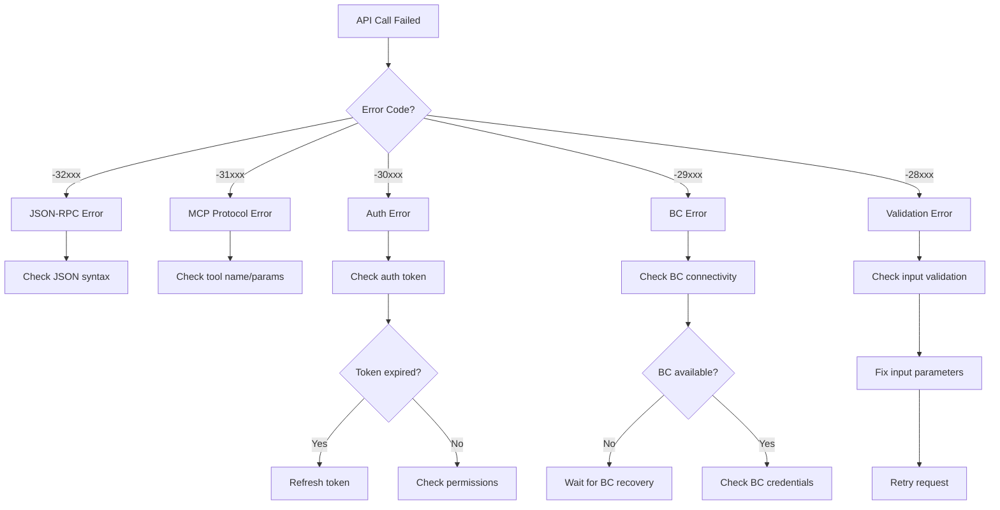

# Error Catalog & Handling Guide

## Overview

The Business Central MCP Server implements a comprehensive error handling system with structured error codes, detailed messages, and clear resolution guidance. This catalog documents all error conditions and their appropriate responses.

## Error Structure

### Standard Error Response Format
```json
{
  "jsonrpc": "2.0",
  "id": "request-id",
  "error": {
    "code": -32602,
    "message": "Invalid params",
    "data": {
      "type": "VALIDATION_ERROR",
      "details": "Required parameter 'name' is missing",
      "field": "name",
      "correlationId": "abc123-def456-ghi789",
      "timestamp": "2024-01-15T10:30:00.123Z",
      "retryable": false,
      "suggestions": [
        "Provide the 'name' parameter in the request",
        "Check the API documentation for required parameters"
      ]
    }
  }
}
```

## Error Code Ranges

| Range | Category | Description |
|-------|----------|-------------|
| **-32768 to -32000** | JSON-RPC Standard | Standard JSON-RPC 2.0 errors |
| **-31999 to -31000** | MCP Protocol | MCP-specific protocol errors |
| **-30999 to -30000** | Authentication | OAuth, token, and auth errors |
| **-29999 to -29000** | Business Central | BC API and connectivity errors |
| **-28999 to -28000** | Validation | Input validation and schema errors |
| **-27999 to -27000** | Rate Limiting | Throttling and quota errors |
| **-26999 to -26000** | Infrastructure | Service availability errors |

## Standard JSON-RPC Errors

### -32700: Parse Error
```json
{
  "code": -32700,
  "message": "Parse error",
  "data": {
    "type": "PARSE_ERROR",
    "details": "Invalid JSON: Unexpected token '}' at position 42",
    "retryable": false,
    "suggestions": ["Check JSON syntax", "Validate JSON with online validator"]
  }
}
```

### -32600: Invalid Request  
```json
{
  "code": -32600,
  "message": "Invalid Request",
  "data": {
    "type": "INVALID_REQUEST",
    "details": "Missing required 'jsonrpc' field",
    "retryable": false,
    "suggestions": ["Include 'jsonrpc': '2.0' in request"]
  }
}
```

### -32601: Method Not Found
```json
{
  "code": -32601,
  "message": "Method not found",
  "data": {
    "type": "METHOD_NOT_FOUND",
    "details": "Method 'invalid/method' is not supported",
    "retryable": false,
    "suggestions": [
      "Use supported methods: tools/list, tools/call, resources/list, resources/read",
      "Check method name spelling"
    ]
  }
}
```

### -32602: Invalid Params
```json
{
  "code": -32602,
  "message": "Invalid params",
  "data": {
    "type": "INVALID_PARAMS",
    "details": "Parameter 'arguments.top' must be a number between 1 and 1000",
    "field": "arguments.top",
    "value": "invalid",
    "retryable": true,
    "suggestions": ["Provide a valid number for 'top' parameter"]
  }
}
```

## MCP Protocol Errors

### -31001: Tool Not Found
```json
{
  "code": -31001,
  "message": "Tool not found",
  "data": {
    "type": "TOOL_NOT_FOUND",
    "details": "Tool 'bc_v2_invalid_entity_list' does not exist",
    "toolName": "bc_v2_invalid_entity_list",
    "retryable": false,
    "suggestions": [
      "Use tools/list to get available tools",
      "Check tool name spelling",
      "Verify the entity exists in Business Central"
    ]
  }
}
```

### -31002: Tool Execution Failed
```json
{
  "code": -31002,
  "message": "Tool execution failed",
  "data": {
    "type": "TOOL_EXECUTION_ERROR",
    "details": "Business Central API returned an error",
    "toolName": "bc_v2_customers_list",
    "bcError": {
      "code": "InvalidFilter",
      "message": "The filter expression is invalid"
    },
    "retryable": true,
    "suggestions": [
      "Check OData filter syntax",
      "Verify field names exist in Business Central",
      "Try without filter to test basic connectivity"
    ]
  }
}
```

### -31003: Resource Not Found
```json
{
  "code": -31003,
  "message": "Resource not found",
  "data": {
    "type": "RESOURCE_NOT_FOUND",
    "details": "Resource 'bc://customers/CUST-999' not found",
    "resourceUri": "bc://customers/CUST-999",
    "retryable": false,
    "suggestions": [
      "Check if the customer ID exists",
      "Verify you have access to this customer",
      "Use resources/list to see available resources"
    ]
  }
}
```

## Authentication Errors

### -30001: Authentication Required
```json
{
  "code": -30001,
  "message": "Authentication required",
  "data": {
    "type": "AUTHENTICATION_REQUIRED",
    "details": "No valid authentication provided",
    "retryable": true,
    "authMethods": ["OAuth 2.0", "Bearer Token"],
    "suggestions": [
      "Include Authorization: Bearer {token} header",
      "Complete OAuth flow first",
      "Check token expiration"
    ]
  }
}
```

### -30002: Token Expired
```json
{
  "code": -30002,
  "message": "Token expired",
  "data": {
    "type": "TOKEN_EXPIRED",
    "details": "OAuth token expired at 2024-01-15T09:30:00Z",
    "expiredAt": "2024-01-15T09:30:00Z",
    "retryable": true,
    "suggestions": [
      "Refresh the OAuth token",
      "Re-authenticate if refresh token expired",
      "Check token lifetime configuration"
    ]
  }
}
```

### -30003: Tenant Mismatch
```json
{
  "code": -30003,
  "message": "Tenant mismatch",
  "data": {
    "type": "TENANT_MISMATCH",
    "details": "Token tenant 'tenant-a' does not match URL tenant 'tenant-b'",
    "tokenTenant": "tenant-a",
    "urlTenant": "tenant-b",
    "retryable": false,
    "suggestions": [
      "Use correct tenant ID in URL path",
      "Verify you're using the right OAuth token",
      "Check tenant authorization"
    ]
  }
}
```

## Business Central Errors

### -29001: BC API Unavailable
```json
{
  "code": -29001,
  "message": "Business Central API unavailable",
  "data": {
    "type": "BC_API_UNAVAILABLE",
    "details": "Connection to Business Central timed out after 30 seconds",
    "bcEndpoint": "https://api.businesscentral.dynamics.com/v2.0/{tenant}/{env}",
    "retryable": true,
    "retryAfter": 60,
    "suggestions": [
      "Retry the request after 60 seconds",
      "Check Business Central service status",
      "Verify network connectivity"
    ]
  }
}
```

### -29002: BC Authentication Failed
```json
{
  "code": -29002,
  "message": "Business Central authentication failed",
  "data": {
    "type": "BC_AUTH_FAILED",
    "details": "Invalid client credentials for Business Central",
    "retryable": false,
    "suggestions": [
      "Check BC client ID and secret configuration",
      "Verify app registration permissions",
      "Check if credentials need rotation"
    ]
  }
}
```

### -29003: Company Not Found
```json
{
  "code": -29003,
  "message": "Company not found",
  "data": {
    "type": "COMPANY_NOT_FOUND",
    "details": "Company 'INVALID_COMPANY' not found in environment 'Production'",
    "companyId": "INVALID_COMPANY",
    "environment": "Production",
    "retryable": false,
    "suggestions": [
      "Check company name spelling",
      "Verify company exists in the specified environment",
      "Use company GUID instead of name"
    ]
  }
}
```

## Rate Limiting Errors

### -27001: Rate Limit Exceeded
```json
{
  "code": -27001,
  "message": "Rate limit exceeded",
  "data": {
    "type": "RATE_LIMIT_EXCEEDED",
    "details": "Exceeded 100 requests per minute limit",
    "limit": 100,
    "resetTime": "2024-01-15T10:31:00Z",
    "retryable": true,
    "retryAfter": 60,
    "suggestions": [
      "Wait 60 seconds before retrying",
      "Implement request batching",
      "Consider upgrading to higher tier for increased limits"
    ]
  }
}
```

### -27002: Quota Exceeded
```json
{
  "code": -27002,
  "message": "Monthly quota exceeded",
  "data": {
    "type": "QUOTA_EXCEEDED",
    "details": "Monthly API call quota of 10,000 requests exceeded",
    "quota": 10000,
    "used": 10001,
    "resetDate": "2024-02-01T00:00:00Z",
    "retryable": false,
    "suggestions": [
      "Wait until quota resets on February 1st",
      "Upgrade to higher tier for increased quota",
      "Optimize request patterns to reduce API calls"
    ]
  }
}
```

## Error Handling Best Practices

### 1. Client-Side Error Handling

```typescript
interface ErrorHandler {
  handleMCPError(error: MCPError): Promise<void>;
  shouldRetry(error: MCPError): boolean;
  getRetryDelay(error: MCPError, attempt: number): number;
}

class MCPErrorHandler implements ErrorHandler {
  async handleMCPError(error: MCPError): Promise<void> {
    switch (error.code) {
      case -30002: // Token expired
        await this.refreshToken();
        break;
        
      case -27001: // Rate limit exceeded
        const delay = error.data.retryAfter * 1000;
        await this.sleep(delay);
        break;
        
      case -29001: // BC API unavailable
        await this.enableCircuitBreaker('business-central', 300);
        break;
        
      default:
        this.logger.error('Unhandled MCP error', { error });
    }
  }
  
  shouldRetry(error: MCPError): boolean {
    const retryableCodes = [-30002, -27001, -29001, -26001];
    return retryableCodes.includes(error.code) && error.data.retryable;
  }
  
  getRetryDelay(error: MCPError, attempt: number): number {
    // Exponential backoff with jitter
    const baseDelay = error.data.retryAfter || 1;
    const exponentialDelay = baseDelay * Math.pow(2, attempt);
    const jitter = Math.random() * 1000;
    return exponentialDelay * 1000 + jitter;
  }
}
```

### 2. Server-Side Error Mapping

```typescript
class ErrorMapper {
  mapBusinessCentralError(bcError: any): MCPError {
    // Map BC OData errors to MCP errors
    const errorMappings = {
      'InvalidFilter': {
        code: -28001,
        message: 'Invalid OData filter',
        suggestions: ['Check filter syntax', 'Verify field names']
      },
      'Unauthorized': {
        code: -29002,
        message: 'Business Central authentication failed',
        suggestions: ['Check credentials', 'Verify permissions']
      },
      'NotFound': {
        code: -29003,
        message: 'Resource not found in Business Central',
        suggestions: ['Check resource ID', 'Verify entity exists']
      }
    };
    
    const mapping = errorMappings[bcError.code] || {
      code: -29999,
      message: 'Unknown Business Central error',
      suggestions: ['Check Business Central logs', 'Contact support']
    };
    
    return {
      ...mapping,
      data: {
        type: 'BC_API_ERROR',
        details: bcError.message,
        bcError: bcError,
        retryable: this.isRetryableError(bcError),
        correlationId: this.generateCorrelationId()
      }
    };
  }
}
```

## Error Recovery Strategies

### 1. Retry Logic with Circuit Breaker

```typescript
interface CircuitBreakerConfig {
  failureThreshold: number;
  resetTimeout: number;
  halfOpenMaxCalls: number;
}

class CircuitBreaker {
  private state: 'CLOSED' | 'OPEN' | 'HALF_OPEN' = 'CLOSED';
  private failureCount = 0;
  private lastFailureTime = 0;
  
  async execute<T>(operation: () => Promise<T>): Promise<T> {
    if (this.state === 'OPEN') {
      if (Date.now() - this.lastFailureTime > this.config.resetTimeout) {
        this.state = 'HALF_OPEN';
      } else {
        throw new Error('Circuit breaker is OPEN');
      }
    }
    
    try {
      const result = await operation();
      this.onSuccess();
      return result;
    } catch (error) {
      this.onFailure();
      throw error;
    }
  }
  
  private onSuccess(): void {
    this.failureCount = 0;
    this.state = 'CLOSED';
  }
  
  private onFailure(): void {
    this.failureCount++;
    this.lastFailureTime = Date.now();
    
    if (this.failureCount >= this.config.failureThreshold) {
      this.state = 'OPEN';
    }
  }
}
```

### 2. Graceful Degradation

```typescript
class GracefulDegradationService {
  async handleServiceUnavailability(service: string, operation: string): Promise<any> {
    switch (service) {
      case 'business-central':
        return await this.handleBCUnavailability(operation);
      case 'metadata-service':
        return await this.handleMetadataUnavailability(operation);
      case 'cache-service':
        return await this.handleCacheUnavailability(operation);
    }
  }
  
  private async handleBCUnavailability(operation: string): Promise<any> {
    if (operation === 'tools/list') {
      // Return cached tools or static fallback
      return await this.getCachedTools() || this.getStaticFallbackTools();
    } else {
      // For data operations, return meaningful error
      throw new MCPError(-29001, 'Business Central temporarily unavailable', {
        type: 'BC_API_UNAVAILABLE',
        retryable: true,
        retryAfter: 120
      });
    }
  }
}
```

## Error Monitoring & Alerting

### 1. Error Rate Monitoring

```kusto
// Error rate by error code
AppServiceConsoleLogs
| where TimeGenerated > ago(1h)
| where Log contains "error"
| extend ErrorCode = extract(@'"code":(-?\d+)', 1, Log)
| extend ErrorType = extract(@'"type":"([^"]+)"', 1, Log)
| summarize ErrorCount=count() by ErrorCode, ErrorType
| order by ErrorCount desc
```

### 2. Alert Rules

```typescript
interface ErrorAlertRule {
  errorCode: number;
  threshold: number;
  timeWindow: number;
  severity: 'low' | 'medium' | 'high' | 'critical';
  actions: string[];
}

const errorAlertRules: ErrorAlertRule[] = [
  {
    errorCode: -29001, // BC API unavailable
    threshold: 10,     // 10 errors
    timeWindow: 300,   // in 5 minutes
    severity: 'critical',
    actions: ['page-oncall', 'create-incident', 'enable-circuit-breaker']
  },
  {
    errorCode: -30003, // Tenant mismatch (security)
    threshold: 5,      // 5 attempts
    timeWindow: 60,    // in 1 minute
    severity: 'high',
    actions: ['security-alert', 'block-ip', 'notify-security-team']
  },
  {
    errorCode: -27001, // Rate limit exceeded
    threshold: 100,    // 100 errors
    timeWindow: 300,   // in 5 minutes
    severity: 'medium',
    actions: ['scale-up', 'notify-ops-team']
  }
];
```

## Error Documentation for Clients

### 1. Integration Guide Errors

#### Common Integration Errors
| Error | Cause | Solution |
|-------|-------|----------|
| `-32600` | Malformed JSON-RPC request | Validate request structure |
| `-30001` | Missing Authorization header | Include Bearer token |
| `-31001` | Invalid tool name | Use tools/list first |
| `-29003` | Company not found | Verify company ID |
| `-28001` | Invalid OData filter | Check filter syntax |

#### Error Handling Example
```typescript
async function callMCPTool(toolName: string, params: any): Promise<any> {
  try {
    const response = await mcpClient.callTool(toolName, params);
    return response.result;
  } catch (error) {
    if (error.code === -30002) {
      // Token expired - refresh and retry
      await mcpClient.refreshToken();
      return await mcpClient.callTool(toolName, params);
    } else if (error.code === -27001) {
      // Rate limited - wait and retry
      await sleep(error.data.retryAfter * 1000);
      return await mcpClient.callTool(toolName, params);
    } else {
      // Log error and re-throw
      console.error('MCP tool call failed:', error);
      throw error;
    }
  }
}
```

### 2. Troubleshooting Decision Tree



## Error Testing

### 1. Error Scenario Tests

```typescript
describe('Error Handling', () => {
  test('should handle BC API unavailability gracefully', async () => {
    // Mock BC API to return 503
    mockBCApi.setup().returns(503);
    
    const response = await mcpGateway.post('/v2.0/tenant/env/api/v2.0/companies(id)')
      .send({ jsonrpc: '2.0', method: 'tools/call', params: { name: 'bc_v2_customers_list' } });
    
    expect(response.body.error.code).toBe(-29001);
    expect(response.body.error.data.retryable).toBe(true);
    expect(response.body.error.data.retryAfter).toBeGreaterThan(0);
  });
  
  test('should detect and block cross-tenant access', async () => {
    const tenantAToken = await getTestToken('tenant-a');
    
    const response = await mcpGateway.post('/v2.0/tenant-b/env/api/v2.0/companies(id)')
      .set('Authorization', `Bearer ${tenantAToken}`)
      .send({ jsonrpc: '2.0', method: 'tools/list' });
    
    expect(response.status).toBe(403);
    expect(response.body.error.code).toBe(-30003);
    expect(response.body.error.data.type).toBe('TENANT_MISMATCH');
  });
});
```

### 2. Error Recovery Testing

```bash
#!/bin/bash
# Test error recovery scenarios

echo "Testing error recovery scenarios..."

# Test 1: BC API recovery
echo "Simulating BC API failure..."
./simulate-bc-failure.sh &
FAILURE_PID=$!

sleep 5
RESPONSE=$(curl -s -X POST https://{{GATEWAY_HOST}}/v2.0/test/env/api/v2.0/companies(test) \
  -d '{"jsonrpc":"2.0","method":"tools/list","id":1}')

ERROR_CODE=$(echo $RESPONSE | jq '.error.code')
if [ "$ERROR_CODE" = "-29001" ]; then
  echo "✅ BC failure handled correctly"
else
  echo "❌ BC failure not handled correctly"
fi

# Restore BC API
kill $FAILURE_PID

# Test 2: Token refresh
echo "Testing token refresh..."
EXPIRED_TOKEN="eyJ0eXAiOiJKV1QiLCJhbGciOiJSUzI1NiIs..." # Expired token
RESPONSE=$(curl -s -X POST https://{{GATEWAY_HOST}}/v2.0/test/env/api/v2.0/companies(test) \
  -H "Authorization: Bearer $EXPIRED_TOKEN" \
  -d '{"jsonrpc":"2.0","method":"tools/list","id":1}')

ERROR_CODE=$(echo $RESPONSE | jq '.error.code')
if [ "$ERROR_CODE" = "-30002" ]; then
  echo "✅ Token expiry handled correctly"
else
  echo "❌ Token expiry not handled correctly"
fi
```

This error catalog provides comprehensive coverage of all error conditions with clear resolution guidance and robust recovery strategies.
