# Architecture Diagrams

## System Overview

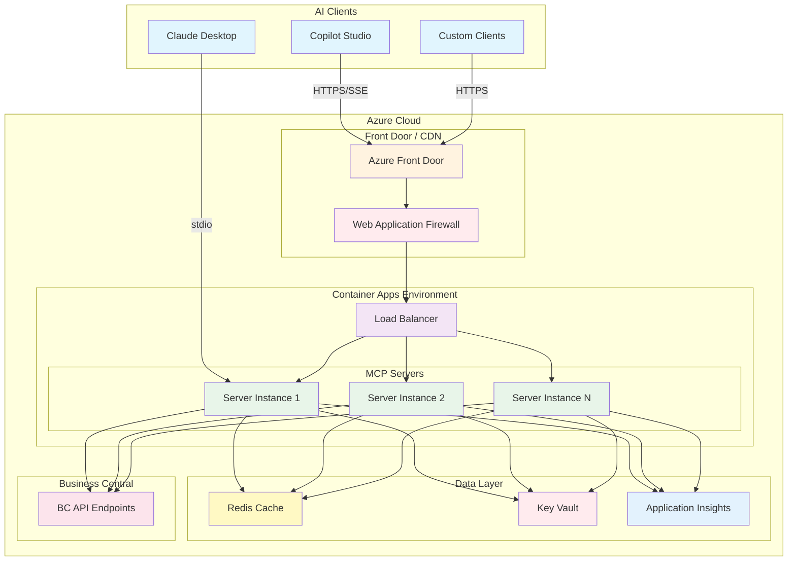

## Request Flow Sequence

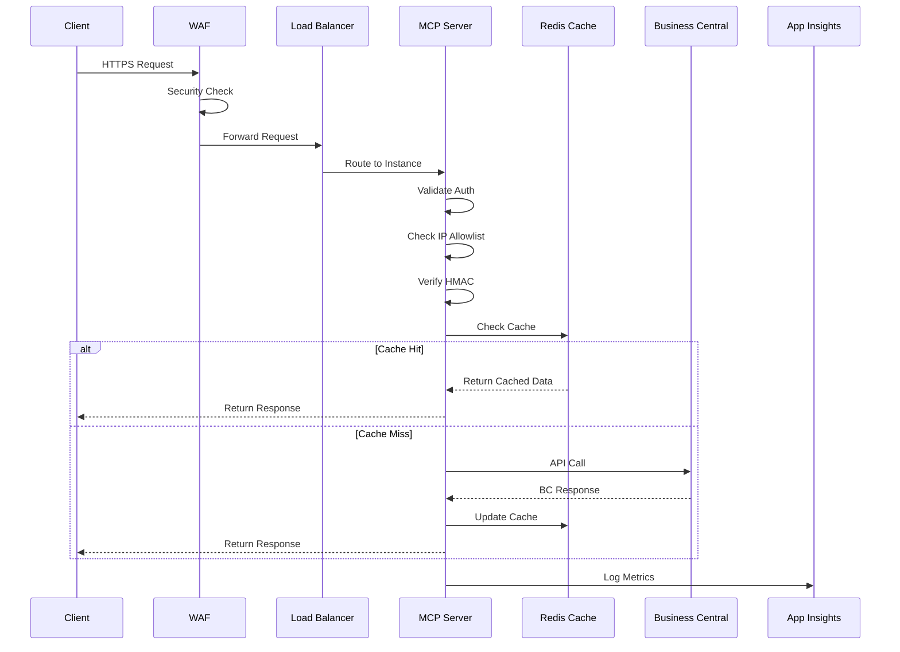

## Component Details

### Transport Layer Architecture

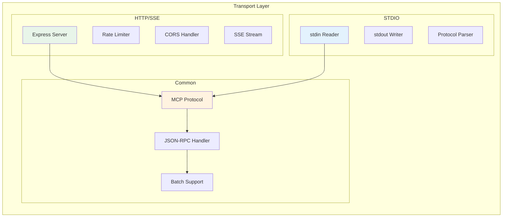

### Security Layer Architecture

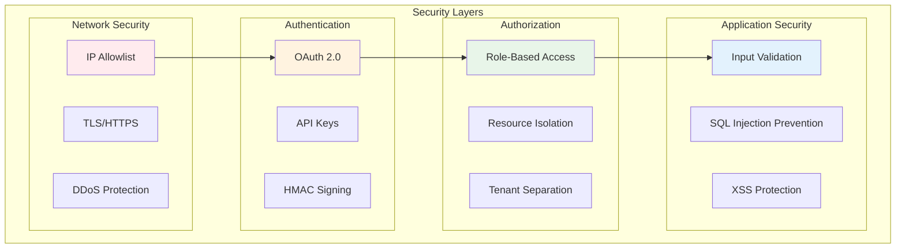

### Caching Strategy

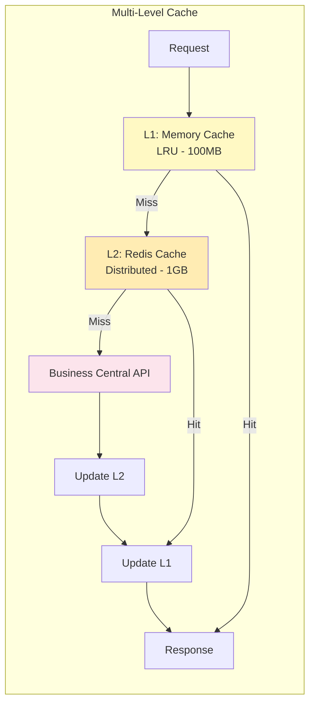

### Circuit Breaker State Machine

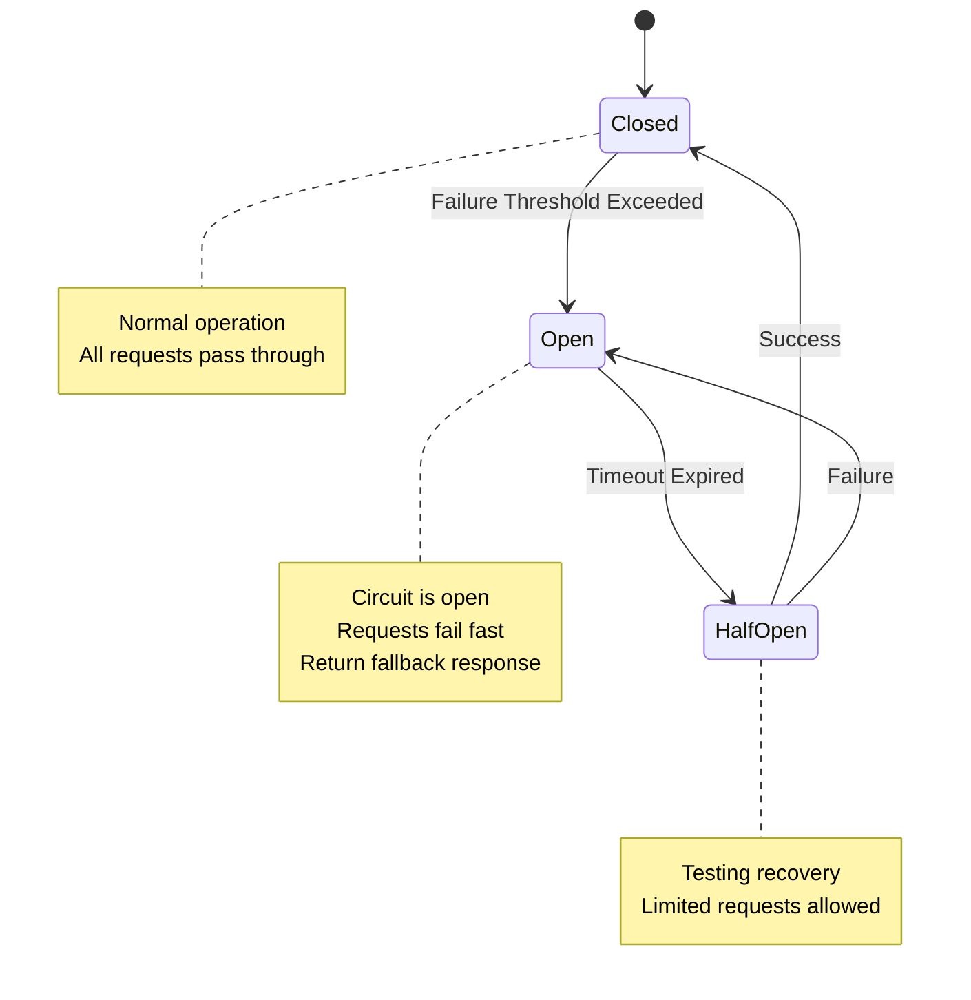

### Deployment Architecture

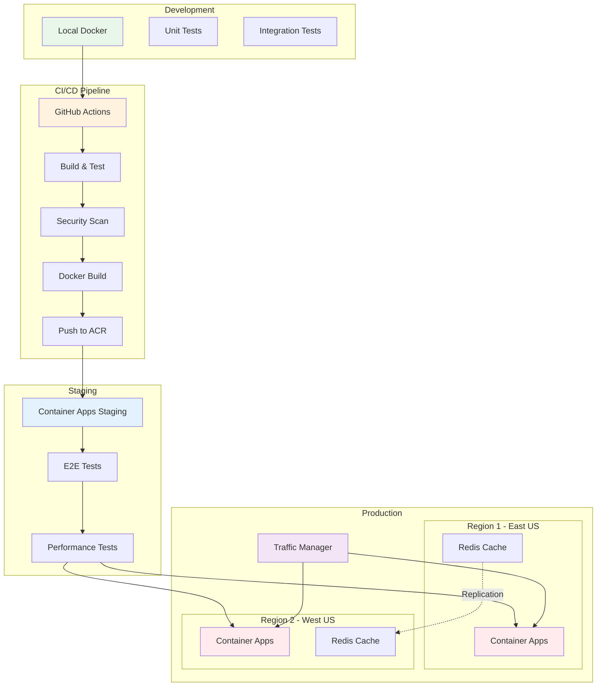

### Data Flow Architecture

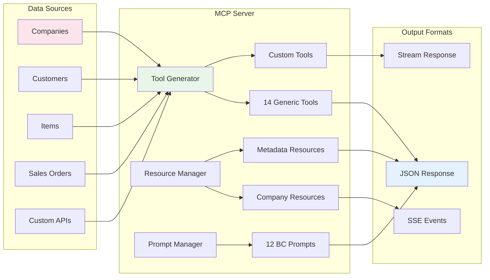

### Monitoring Architecture

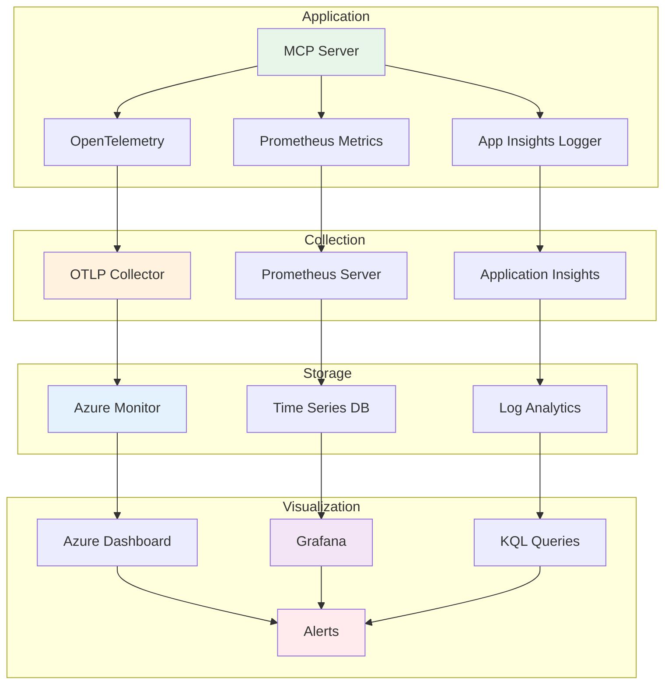

### High Availability Architecture

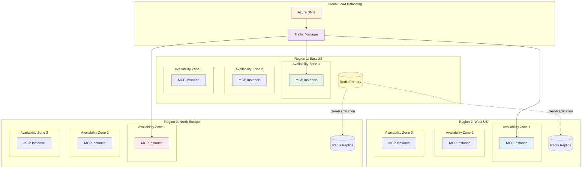

## Performance Optimization Flow

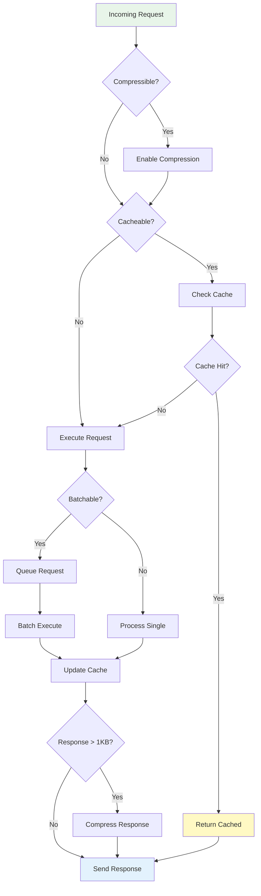

---

*These diagrams represent the current architecture of Business Central MCP Server v2.2.7. For implementation details, see the [source code](../../src/).*